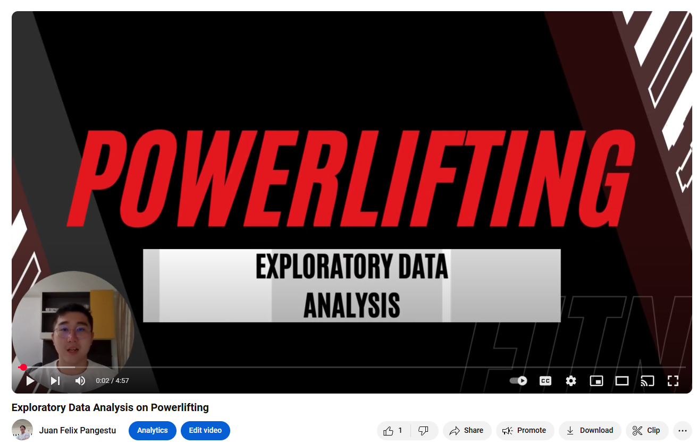
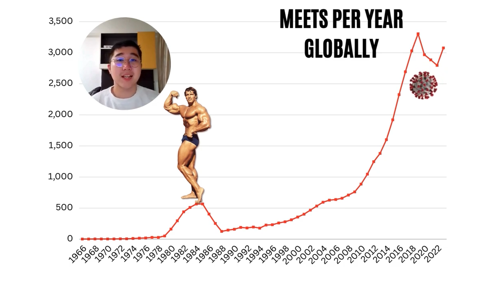

# Powerlifting Data Analysis/Visualization Project

## Overview
This project focuses on analyzing the powerlifting records dataset provided by OpenPowerlifting. The primary goal is to enhance understanding of the sport through data analysis and visualization, ultimately aiming to promote awareness of powerlifting.

**You can watch a youtube video on my visualization here:**

https://youtu.be/gJ_-qDPUjxk

## Objectives
The main objectives of this project include:

- **Analyzing Popularity Trends**: Investigating when and where powerlifting has gained popularity, as illustrated in Figures 1 and 2.
- **Equipment Impact Analysis**: Examining how different equipment affects athletes' total weight lifted, shown in Figures 3 and 4.
- **Gender Performance Comparison**: Comparing male and female athletes in terms of absolute and relative strength to highlight gender differences in performance and promote inclusivity.
- **Strength Measurement Evaluation**: Identifying the best metrics for assessing strength in powerlifting, providing a nuanced understanding of effective strength assessment.

In summary, this project aims to showcase powerlifting as a sport and increase its visibility.

## Novelty
This project introduces several original contributions to data visualization:

- **Stacked Histogram**: A unique stacked histogram was employed to analyze absolute strength differences between male and female powerlifters. This technique effectively visualizes strength distribution across genders, revealing both differences and overlaps (Figure 5).
- **Systematic Classification**: The dataset was classified according to weight and age categories following the standards set by the International Powerlifting Federation (IPF), ensuring accurate analysis.

## Technical Challenges and Innovations
The following tools and techniques were utilized in this project:

- **Data Visualization Tools**: Matplotlib and Seaborn libraries were used for initial data exploration and visualization, enabling the identification of key trends.
- **Video Editing**: Canva was utilized for video editing, enhancing the aesthetic quality of visualizations and ensuring clear communication of information.
- **Dynamic Visualizations**: Animated visualizations were created to aid viewer comprehension, although challenges arose due to Canva's limitations regarding interactivity.

### Challenges Encountered
- **Null Values**: The dataset contained numerous null values due to varying record-keeping standards across different powerlifting federations. Addressing data consistency was crucial for accurate analysis.
- **Dynamic Visual Limitations**: Achieving desired interactivity levels in certain graphs proved challenging within Canva.

## Conclusion
This Powerlifting Data Analysis/Visualization project not only provides insights into the sport but also emphasizes the importance of data-driven approaches in understanding athletic performance. The innovative visual techniques employed serve to enhance engagement and understanding among viewers. 

For more details, you can view the accompanying YouTube video that presents these findings visually.

Citations:
[1] https://github.com/AlexanderSteindorfer/data_analysis_powerlifting
[2] https://nischalshrestha.me/docs/dissertation.pdf
[3] https://towardsdatascience.com/powerlifting-data-and-exploratory-data-analysis-part-1-6f21d79ac5db?gi=7edcabecf89d
[4] https://www.linkedin.com/posts/swapnildeore_github-swapppyydata-analysis-on-my-favorite-youtubers-activity-7130821299404189696-8dQk
[5] http://optimumsportsperformance.com/blog/tidytuesday-powerlifting-performance-age/
[6] https://www.reddit.com/r/powerlifting/comments/bn05pg/machine_learning_to_analyze_openpowerlifting_data/
[7] https://github.com/Suprith-Satish/Powerlifting-Data-Analysis
[8] https://www.rpubs.com/yashwanthk_yelamanchili/IPF_Phase2

# Steps to Start

pip install -r requirements.txt

before checking code
